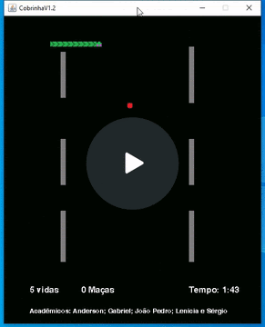

# Game Skane em Java

Um jogo simples desenvolvido em Java, chamado Skane, inspirado no clássico jogo SnakeGame.

## Funcionalidades

- Exibição de informações dos acadêmicos envolvidos na realização do projeto;
- Controle da cobrinha para coletar itens na tela;
- Pontuação acumulada conforme a cobrinha coleta os itens;
- "Vida" adicional conforme regra de negócio;
- Tempo
- Interface simples e intuitiva.

## Pré-requisitos

Antes de começar, certifique-se de ter o JDK 19 (ou versão superior) instalado e configurado no seu ambiente de desenvolvimento.

## Demonstração



## Como Usar

Clone o repositório:
```bash
git clone https://github.com/Sergioadjr/Snake-Game.git
```

Navegue até o diretório do projeto:
```bash
cd Desktop
```
Compile o código-fonte:
```bash
javac Snake-Game.java
```
Execute o aplicativo:
```bash
java Snake-Game
```
O jogo será aberto.

## Controles do Jogo
- Utilize as teclas de direção (setas) para movimentar a cobrinha.
- Colete os itens (maças) na tela para acumular pontos.
- Tome cuidado para não colidir com os obstáculos ou com o próprio corpo da cobrinha.
- Optamos pela borda infinita, ou seja, a cobrinha não colide nas bordas.